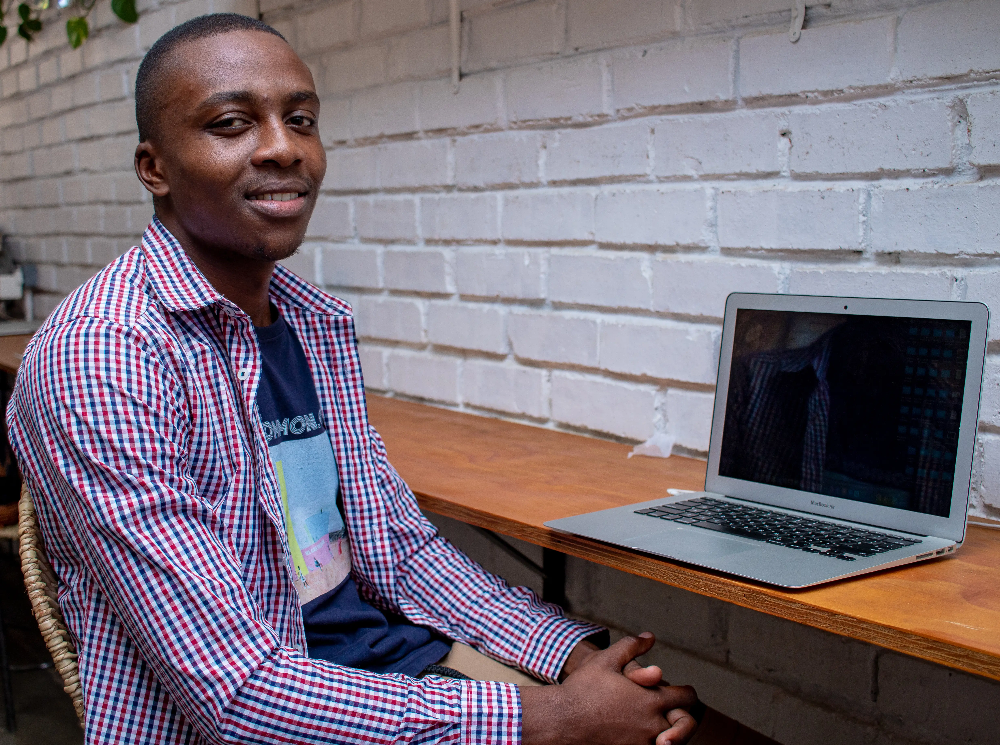

<h1 align="center">Tadiwanashe Rodney Zvidza</h1>

	Builder. Problem-solver. Future-focused developer.

	<a href="https://tadiwanashe.vercel.app"><strong>Open Portfolio</strong></a>

---

## The Beginning

That image below is where it all started.
It represents the first spark, the first build, and the mindset that still drives every project I ship. 
At the Uncommon.org 22-23 Tech Bootcamp, Mufakose Hub

	

	Click the image to visit my website.

---

## About Me

- I turn ideas into products with clean architecture and strong execution.
- I care about user experience, performance, and maintainable code.
- I treat every commit as a step toward mastery.

## What You Will Find Here

- Real projects with clear intent and practical value.
- Experiments that push my skills forward.
- A developer who keeps learning, shipping, and improving.

## Connect

- Portfolio: [tadiwanashe.vercel.app](https://tadiwanashe.vercel.app)

<!---
TadiwanasheZvidzaRodney/TadiwanasheZvidzaRodney is a ✨ special ✨ repository because its `README.md` (this file) appears on your GitHub profile.
You can click the Preview link to take a look at your changes.
--->
