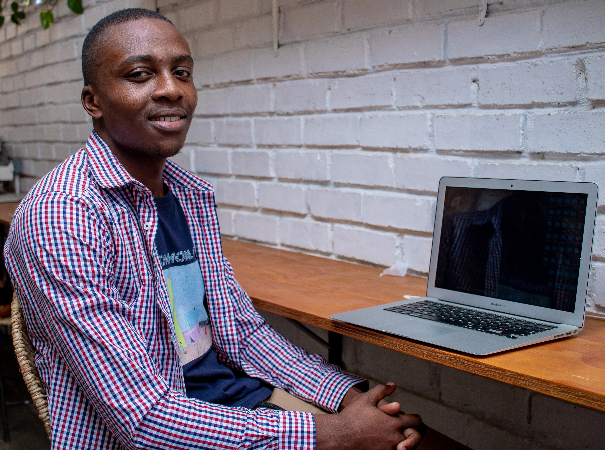

# 👋 Hey there, I'm **Tadiwanashe Zvidza Rodney**

  <em>✨ "Building digital experiences that leave a dent on the universe."</em>

  🎓 <strong>Where it all started:</strong> <a href="https://uncommon.org"><strong>Uncommon.org</strong></a> (2022 – 2023 Tech Bootcamp)

 

  
  
  

  
  
  

---

## ⚡ About Me & Journey

I build modern software with a focus on **performance**, **scalable cloud architecture**, and **intuitive UI/UX design**.  
From crafting responsive frontends to architecting reliable backend systems, I strive to solve complex problems with clean code and real-world impact.

- 🎓 **Foundation:** Started my software engineering journey at the **Uncommon.org (2022–2023 Tech Bootcamp)**.
- 💼 **Professional Role:** Software Engineer at **ZimWorX**.
- ☁️ **Cloud & Credentials:** **AWS** & **IBM** Certified Consultant.
- 🔭 **Focus Areas:** React, Next.js, Node.js, Python, Cloud Infrastructure & Microservices.
- 🎯 **Mission:** Build scalable products that empower users and elevate digital experiences.

 

<b>🔍 Click here to expand & read my engineering philosophy</b>

 

> *"Software is not just code; it's an art of transforming abstract ideas into meaningful tools that solve real human challenges. Keep it simple, maintainable, and ship relentlessly."*

- 📐 **Clean Architecture First:** Modular, tested, and self-documenting code.
- ⚡ **Optimization & Speed:** Fast load times, responsive UI, and minimal memory footprint.
- 🚀 **Continuous Growth:** Always exploring emerging tech stacks and cloud paradigms.

---

## 🧰 Tech Stack & Skills

### **Languages & Frameworks**

### **Backend, Data & Cloud**

---

## 📜 Certifications & Achievements

- ☁️ **AWS Certified** — Cloud Architecture & Deployment
- 🛡️ **IBM Certified** — Software Engineering & Cloud Foundations
- 🎓 **Uncommon.org Alum** — 2022–2023 Tech Bootcamp Graduate

---

## 🚀 Latest Work

<!-- START:latest-projects -->
- [**chatbot**](https://github.com/TadiwanasheZvidzaRodney/chatbot) - A project currently in development. | CSS
- [**TadiwanasheZvidzaRodney**](https://github.com/TadiwanasheZvidzaRodney/TadiwanasheZvidzaRodney) - Config files for my GitHub profile. | JavaScript
- [**image_captionAing**](https://github.com/TadiwanasheZvidzaRodney/image_captionAing) - A project currently in development. | Python
- [**edtp**](https://github.com/TadiwanasheZvidzaRodney/edtp) - A project currently in development. | Rust
- [**the_agent_app_store**](https://github.com/TadiwanasheZvidzaRodney/the_agent_app_store) - A project currently in development. | Python
<!-- END:latest-projects -->

---

## 📈 GitHub Analytics

 

---

## 🤝 Let's Connect & Collaborate!

| Platform | Link |
| :--- | :--- |
| 🌐 **Live Portfolio** | [tadiwanashe.vercel.app](https://tadiwanashe.vercel.app) |
| 💼 **LinkedIn** | [Tadiwanashe Zvidza](https://www.linkedin.com/in/tadiwanashe-zvidza-48583424b) |
| 🐙 **GitHub** | [@TadiwanasheZvidzaRodney](https://github.com/TadiwanasheZvidzaRodney) |
| 🐦 **Twitter / X** | [@mysterious_son](https://twitter.com/mysterious_son) |
| 📘 **Facebook** | [Tadiwanashe Rodney Zvidza](https://www.facebook.com/tadiwanasherodneyzvidza/) |

 

---

  <strong>“Build boldly. Keep it simple. Ship relentlessly.”</strong> — Tadiwanashe Zvidza Rodney

